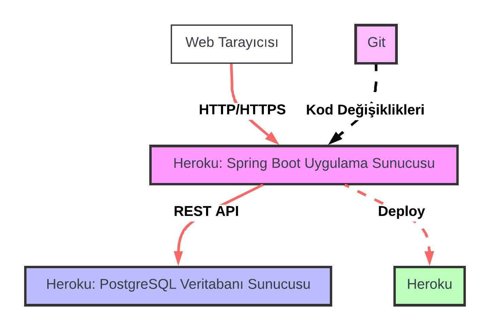

<h1 align="center">Veteriner Klinik Yönetim Sistemi</h1>
<h3 align="center">Veteriner klinikleri için yönetim sistemi API projesi</h3>

<br/>

<p align="center"> 
  
</p>


<p>
<b>Backend API Projesi Production:</b> <a href="https://patika-dev-57981ef145be.herokuapp.com/">https://patika-dev-57981ef145be.herokuapp.com/</a><br/><br/>
<b>Backend Swagger Production:</b> <a href="https://patika-dev-57981ef145be.herokuapp.com/swagger-ui/index.html">https://patika-dev-57981ef145be.herokuapp.com/swagger-ui/index.html</a><br/><br/>
<b>Örnek Database:</b> <a href="docs/db/veterinary.sql">veterinary.sql</a>
</p>


<!-- TABLE OF CONTENTS -->
<h2 id="table-of-contents"> :book: İçerik</h2>

<details open="open">
  <summary>İçerik</summary>
  <ol>
    <li><a href="#proje-ozeti"> ➤ Proje Özeti</a></li>
    <li><a href="#teknolojiler"> ➤ Kullanılan Teknolojiler</a></li>
    <li><a href="#kurulum"> ➤ Kurulum ve Başlatma</a></li>
    <li><a href="#kurulum"> ➤ UML Diyagramı</a></li>
    <li><a href="#kullanici-yonetimi"> ➤ Hayvanların ve Sahiplerinin Yönetimi</a></li>
    <li><a href="#hasta-yonetimi"> ➤ Uygulanan Aşıların Yönetimi</a></li>
    <li><a href="#randevu-yonetimi"> ➤ Randevu Yönetimi</a></li>
    <li><a href="#doktor-yonetimi"> ➤ Veteriner Doktor Yönetimi</a></li>
    <li><a href="#müsaitlik-yonetimi"> ➤ Doktorların Müsait Günlerinin Yönetimi</a></li>
    <li><a href="#endpoint"> ➤ Endpointler</a></li>
    <li><a href="#usecase"> ➤ Use-Case Diyagram</a></li>
    <li><a href="#sequence"> ➤ Sequence Diyagram</a></li>
    <li><a href="#deployment"> ➤ Deployment Diyagram</a></li>
    <li><a href="#iletisim"> ➤ İletişim</a></li>
  </ol>
</details>


<!-- PROJECT OVERVIEW -->
<h2 id="proje-ozeti"> :mag_right: Proje Özeti</h2>

<p align="justify"> 
Bu proje, bir veteriner kliniğinin kendi işlerini yönetebildiği bir API'nin geliştirilmesini amaçlamaktadır. API, veteriner çalışanları tarafından kullanılmak üzere tasarlanmıştır. Bu API aracılığıyla, veteriner kliniği çalışanları aşağıdaki işlevleri gerçekleştirebilecektir:

<li>Veteriner doktorlarını kaydetme ve yönetme</li>
<li>Müşterileri kaydetme ve yönetme</li>
<li>Hayvanları kaydetme ve yönetme</li>
<li>Hayvanlara aşıları kaydetme ve yönetme</li>
<li>Hayvanlara randevu oluşturma ve yönetme</li>


</p>


<!-- USED TECHNOLOGIES -->
<h2 id="teknolojiler"> :computer: Kullanılan Teknolojiler</h2>

<p align="justify"> 
Projede kullanılan teknolojiler:

[](https://www.python.org/) <br>
[](https://www.python.org/) <br>
[](https://www.python.org/) <br>

</p>


<!-- SETUP AND LAUNCH -->
<h2 id="kurulum"> :hammer: Kurulum ve Başlatma</h2>

<p align="justify"> 
Projeyi  klonlamak ve çalıştırmak için aşağıdaki adımları takip edin:

```bash
git clone https://github.com/esrasen/vet-clinic-api.git
cd vet-clinic-api
```

Projeyi IDE'nizde açın ve `Main` sınıfını çalıştırın.
</p>


<!-- UML DIAGRAM -->
<h2 id="uml-diyagrami"> :bar_chart: UML Diyagramı</h2>

.png)


<!-- USER MANAGEMENT -->
<h2 id="kullanici-yonetimi"> :busts_in_silhouette: Hayvanların ve Sahiplerinin Yönetimi</h2>

<p align="justify">
Veteriner klinik yönetim sistemi, hayvanların ve sahiplerinin bilgilerini kaydetmek için bir veritabanı kullanır. Klinik personeli, hayvanların ve sahiplerinin bilgilerini kaydedebilir, güncelleyebilir ve silebilir. Ayrıca, hayvanların ve sahiplerinin bilgilerini görüntüleyebilir ve arayabilir. Hayvan sahiplerinin tüm hayvanlarını arayabilir ve hayvanları isme görebilgilerini getirebilir.
</p>


<!-- VACCİNE MANAGEMENT -->
<h2 id="hasta-yonetimi"> :syringe: Uygulanan Aşıların Yönetimi</h2>

<p align="justify">
Veteriner klinik yönetim sistemi, uygulanan aşıların bilgilerini kaydetmek için bir veritabanı kullanır. Klinik personeli, uygulanan aşıların bilgilerini kaydedebilir, güncelleyebilir, görüntüleyebilir ve silebilir. Ayrıca, girilen hayvanın tüm aşılarını arayabilir.
</p>


<!-- APPOINTMENT MANAGEMENT --> 
<h2 id="randevu-yonetimi"> :calendar: Randevu Yönetimi</h2>

<p align="justify"> 
Veteriner klinik yönetim sistemi, randevu oluşturmak ve yönetmek için bir veritabanı kullanır. Klinik personeli, randevu oluşturabilir, güncelleyebilir ve silebilir. Ayrıca, randevuları görüntüleyebilir ve girilen doktor ve tarih aralığına göre de arayabilir..
</p>


<!-- DOCTOR MANAGEMENT -->
<h2 id="doktor-yonetimi"> :hospital: Veteriner Doktor Yönetimi</h2>

<p align="justify">
Veteriner klinik yönetim sistemi, veteriner doktorların bilgilerini kaydetmek için bir veritabanı kullanır. Klinik personeli, veteriner doktorların bilgilerini kaydedebilir, güncelleyebilir ve silebilir. Ayrıca, veteriner doktorların bilgilerini görüntüleyebilir ve arayabilir.
</p>


<!-- AVAILABILITY MANAGEMENT -->
<h2 id="müsaitlik-yonetimi"> :chart_with_upwards_trend: Doktorların Müsait Günlerinin Yönetimi</h2>

<p align="justify">
Veteriner klinik yönetim sistemi, veteriner doktorların müsait günlerini kaydetmek için bir veritabanı kullanır. Klinik personeli, veteriner doktorların müsait günlerini kaydedebilir, güncelleyebilir ve silebilir. Ayrıca, veteriner doktorların müsait günlerini görüntüleyebilir ve arayabilir.
</p>


<!-- ENDPOINTS -->
<h2 id="endpoint"> :floppy_disk: Endpointler</h2>

<p align="justify">
Veteriner klinik yönetim sistemi, aşağıdaki endpointleri sağlar:
</p>

### Customer Endpoint

| Method   | URL                               | Açıklama                                                                  |
|----------|-----------------------------------|---------------------------------------------------------------------------|
| `GET`    | `/api/customers`                  | Tüm hayvan sahiplerini getirir.                                           |
| `PUT`    | `/api/customers`                  | Hayvan sahiplerinin bilgilerini günceller.                                |
| `POST`   | `/api/customers`                  | Yeni hayvan sahibi ekler.                                                 |
| `GET`    | `/api/customers/{id}`             | ID'si verilen hayvan sahibinin bilgilerini getirir.                       |
| `DELETE` | `/api/customers/{id}`             | ID'si verilen hayvan sahibinin bilgilerini siler.                         |
| `GET`    | `/api/customers/{id}/animals`     | ID'si verilen hayvan sahibinin sistemde kayıtlı tüm hayvanlarını getirir. |
| `GET`    | `/api/customers/info?name={name}` | İsmi yazılan hayvan sahibini getirir.                                     |


### Animal Endpoint

| Method   | URL                           | Açıklama                                    |
|----------|-------------------------------|---------------------------------------------|
| `GET`    | `/api/animals`                | Tüm hayvanları getirir.                     |
| `PUT`    | `/api/animals`              | Hayvanların bilgilerini günceller.          |
| `POST`   | `/api/animals`              | Yeni hayvan ekler.                          |
| `GET`    | `/api/animals/{id}`         | ID'si verilen hayvanın bilgilerini getirir. |
| `DELETE` | `/api/animals/{id}`         | ID'si verilen hayvanın bilgilerini siler.   |
| `GET`    | `/api/animals/info?name={name}` | İsmi yazılan hayvanı getirir.               |


### Vaccine Endpoint

| Method   | URL                                                                     | Açıklama                                                                                               |
|----------|-------------------------------------------------------------------------|--------------------------------------------------------------------------------------------------------|
| `GET`    | `/api/vaccines`                                                         | Tüm aşıları getirir.                                                                                   |
| `PUT`    | `/api/vaccines`                                                         | Aşıların bilgilerini günceller.                                                                        |
| `POST`   | `/api/vaccines`                                                         | Yeni aşı ekler.                                                                                        |
| `GET`    | `/api/vaccines/{id}`                                                    | ID'si verilen aşının bilgilerini getirir.                                                              |
| `DELETE` | `/api/vaccines/{id}`                                                    | ID'si verilen aşının bilgilerini siler.                                                                |
| `GET`    | `/api/vaccines/info?id={id}`                                            | ID'si girilen hayvanın tüm aşılarını getirir.                                                          |
| `GET`    | `/api/vaccines/expiring?startDate={startDate}&?finishDate={finishDate}` | Aşı koruyuculuk tarihi girilen başlangıç ve bitiş tarihleri arasında olan hayvanların listesini döner. |


### Doctor Endpoint

| Method   | URL                  | Açıklama                                    |
|----------|----------------------|---------------------------------------------|
| `GET`    | `/api/doctors`       | Tüm doktorları getirir.                     |
| `PUT`    | `/api/doctors`      | Doktor bilgisini günceller.                 |
| `POST`   | `/api/doctors`      | Yeni doktor ekler.                          |
| `GET`    | `/api/doctors/{id}` | ID'si verilen doktorun bilgilerini getirir. |
| `DELETE` | `/api/doctors/{id}` | ID'si verilen doktorun bilgilerini siler.   |


### Available Date Endpoint

| Method   | URL                    | Açıklama                                     |
|----------|------------------------|----------------------------------------------|
| `GET`    | `/api/available-dates` | Tüm doktorların müsait günlerini getirir.    |
| `PUT`    | `/api/available-dates`         | Doktor için müsait gün bilgisini günceller.  |
| `POST`   | `/api/available-dates`         | Doktor için müsait gün ekler.                |
| `GET`    | `/api/available-dates/{id}`    | ID'si verilen müsait günü getirir.           |
| `DELETE` | `/api/available-dates/{id}`    | ID'si verilen müsait günü  siler. |


### Appointment Endpoint

| Method   | URL                               | Açıklama                                                        |
|----------|-----------------------------------|-----------------------------------------------------------------|
| `GET`    | `/api/appointments/{id}`          | ID'si verilen randevuyu getirir.                                |
| `PUT`    | `/api/appointments/{id}`          | ID'si verilen randevu bilgilerini günceller.                    |
| `DELETE` | `/api/appointments/{id}`          | ID'si verilen randevuyu siler.                                  |
| `GET`    | `/api/appointments`               | Tüm randevuları getirir.                                        |
| `POST`   | `/api/appointments`               | Yeni randevu ekler.                                             |
| `GET`    | `/api/appointments/doctor/search` | Girilen tarih aralığı ve doktora göre olan randevuları getirir. |
| `GET`    | `/api/appointments/animal/search` | Girilen tarih aralığı ve hayvana göre olan randevuları getirir. |


<!-- USE-CASE DIAGRAM -->

<h2 id="usecase"> :chart_with_upwards_trend: Use-Case Diyagram</h2>


<h3>Veteriner Yönetim Senaryosu</h3>
<p>
  
</p>
<h3>Genel Süreç</h3>
<p>
  
</p>


<!-- SEQUENCE DIAGRAM -->

<h2 id="sequence"> :chart_with_upwards_trend: Sequence Diyagram</h2>

<h3>Hayvan Sahibi Yönetim Senaryosu</h3>
<p>
  
</p>
<h3>Aşı Yönetim Senaryosu</h3>
<p>
  
</p>
<h3>Randevu Yönetim Senaryosu</h3>
<p>
  
</p>


<!-- DEPLOYMENT DIAGRAM -->

<h2 id="deployment"> :chart_with_upwards_trend: Deployment Diyagram</h2>

<h3>Deployment Diyagramı</h3>
<p>
  
</p>


<!-- CONTACT -->
<h2 id="iletisim"> :phone: İletişim ve Bilgiler</h2>

<p>
✤ <a href="https://linkedin.com/in/esra-sen">LinkedIn</a> <br>
✤ <a href="https://github.com/esrasen">GitHub</a> <br>
</p>